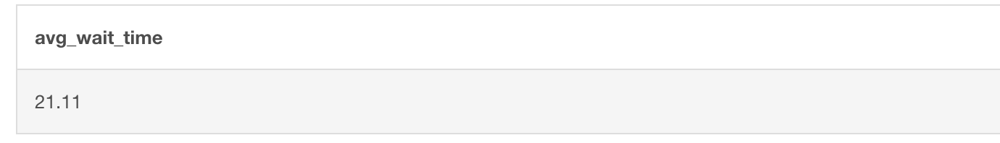

# 🏥 Healthcare Wait Time Analysis Using SQL

## 📌 Objective

Analyze appointment wait times in a hospital to discover scheduling inefficiencies, department bottlenecks, and improve patient service delivery using SQL.

---

## 🧰 Tools Used
- MySQL (via DB Fiddle)
- SQL
- Publicly generated sample dataset

---

## 🗂️ Dataset Overview

| Column | Description |
|--------|-------------|
| appointment_id | Unique ID for each appointment |
| patient_id | Unique ID for each patient |
| doctor_id | Doctor handling the appointment |
| department | Medical department (Cardiology, etc.) |
| appointment_date | Scheduled date |
| appointment_time | Scheduled time |
| checkin_time | Actual check-in time |
| wait_time_minutes | Time difference (in minutes) |
| status | Completed / No Show / Cancelled |

---

## ❓ Business Questions Answered

- What is the **overall average wait time**?
- Which **departments** have the **longest delays**?
- Which **doctors** are associated with more waiting?
- What **times of day** are busiest?
- Do **weekdays** affect wait time?

---
## 🔍 Key Findings
- **Cardiology** had the highest average wait time of 30 minutes.
- Appointments scheduled between 12 PM and 2 PM experienced the longest waits.
- The overall no-show rate was 15%, with Pediatrics having the highest at 25%.

## 🧾 Sample SQL Queries
```sql
-- Average wait time per department
SELECT department, ROUND(AVG(wait_time_minutes), 2) AS avg_wait_time
FROM appointments
WHERE status = 'Completed'
GROUP BY department
ORDER BY avg_wait_time DESC;

### Average Wait Time:
```sql
SELECT ROUND(AVG(wait_time_minutes), 2) AS avg_wait_time 
FROM appointments WHERE status = 'Completed';
```
---
### 📸 Sample Output

Below is an example output of average wait time per department:



---
## ✅ Conclusion

The analysis highlights specific departments and time slots with prolonged wait times, suggesting a need for schedule optimization and resource allocation to enhance patient experience.
---
## 🚀 How to Run This Project

1. Go to [DB Fiddle](https://www.db-fiddle.com/)
2. Create the table using the SQL script in `wait_time_queries.sql`
3. Insert the sample records or upload your own dataset
4. Run each query block and observe the insights
---
## 📂 Project Structure

healthcare-sql-wait-time-analysis/
│
├── dataset/
│ └── hospital_appointments.csv
├── queries/
│ └── wait_time_queries.sql
├── README.md
